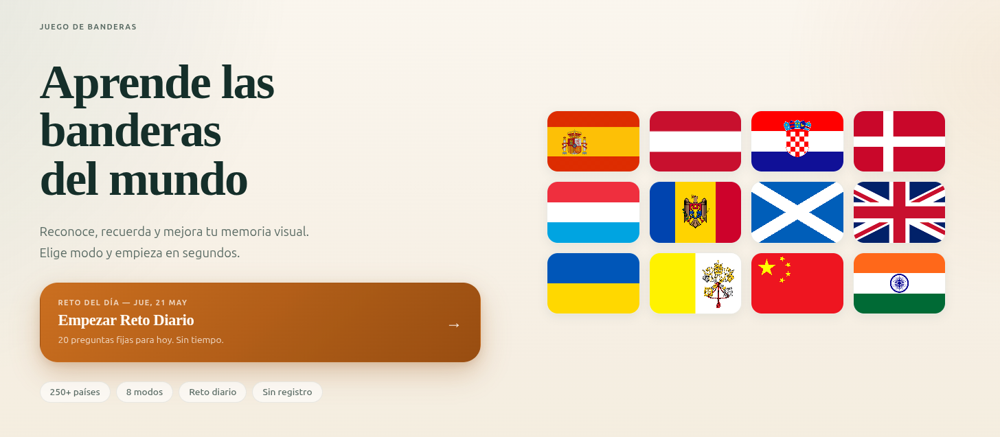
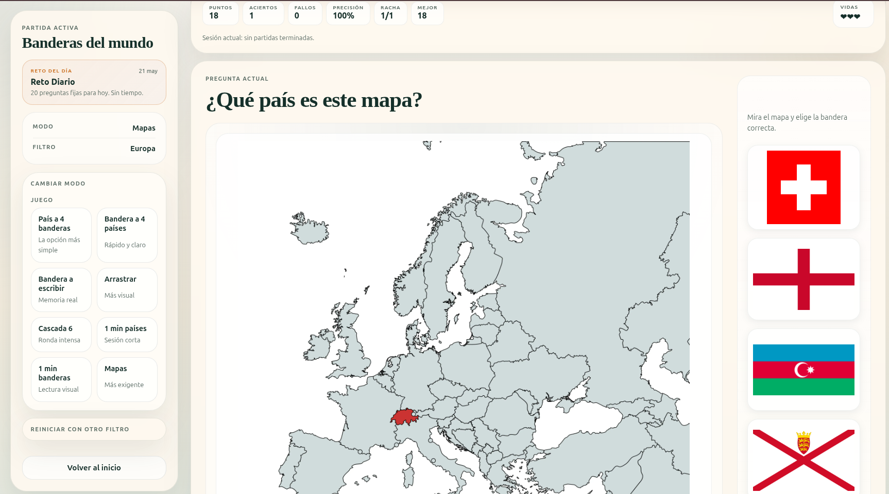
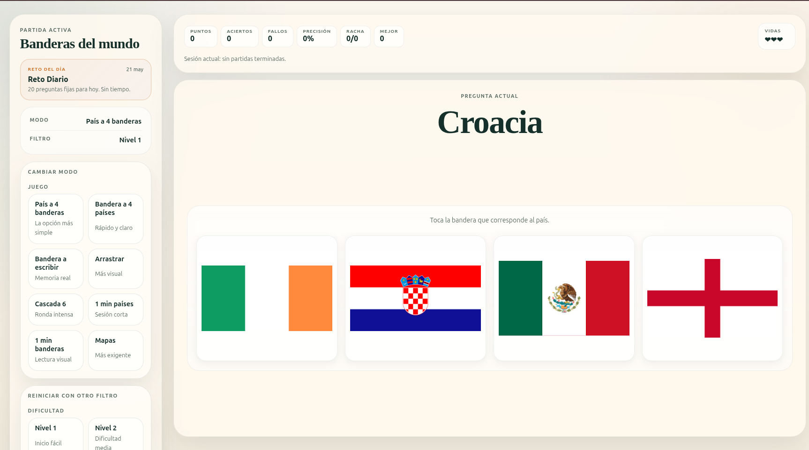

#  Juego de Banderas del Mundo

Aplicación web interactiva para aprender y practicar el reconocimiento de banderas de países.
Proyecto desarrollado como práctica personal combinando lógica en JavaScript, gestión de datos y diseño responsive.

 Demo: https://retobanderas.es

---

##  Características principales

* Amplio conjunto de países con sus banderas
* 8 modos de juego diferentes
* Sistema de puntuación con rachas y bonificaciones
* Reto diario automático
* Filtros por continente y dificultad
* Funciona en móvil y escritorio

---

##  Modos de juego

* País → elegir bandera correcta
* Bandera → elegir país
* Escribir país manualmente
* Arrastrar bandera a mapa
* Modo cascada (progresivo)
* Modos contrarreloj (1 minuto)
* Identificación en mapas
* Tabla informativa

---

##  Qué demuestra este proyecto

Este proyecto refleja:

* Manejo de JavaScript (lógica de juego)
* Manipulación del DOM
* Gestión de datos (JSON)
* Diseño responsive
* Organización de código frontend
* Pensamiento lógico aplicado a un sistema interactivo

---

##  Tecnologías utilizadas

* HTML
* CSS
* JavaScript
* LocalStorage / SessionStorage

---

##  Estructura del proyecto

```
flags-master/
├── index.html
├── game.html
├── assets/
│   ├── ui.css
│   ├──flags/
│   └── maps/
├── data/
│   └── countries.json
└── js/
    ├── data.js
    ├── main.js
    └── game.js
```


---

##  Capturas

###  Inicio


###  Juego


###  Resultado


---

##  Notas

Proyecto enfocado a aprendizaje y práctica.
No requiere backend ni autenticación.

---

##  Autor

Laura Arenas Vicente
Técnica en Administración de Sistemas (ASIR)

 Portfolio: https://lauraarenasvicente.eu
